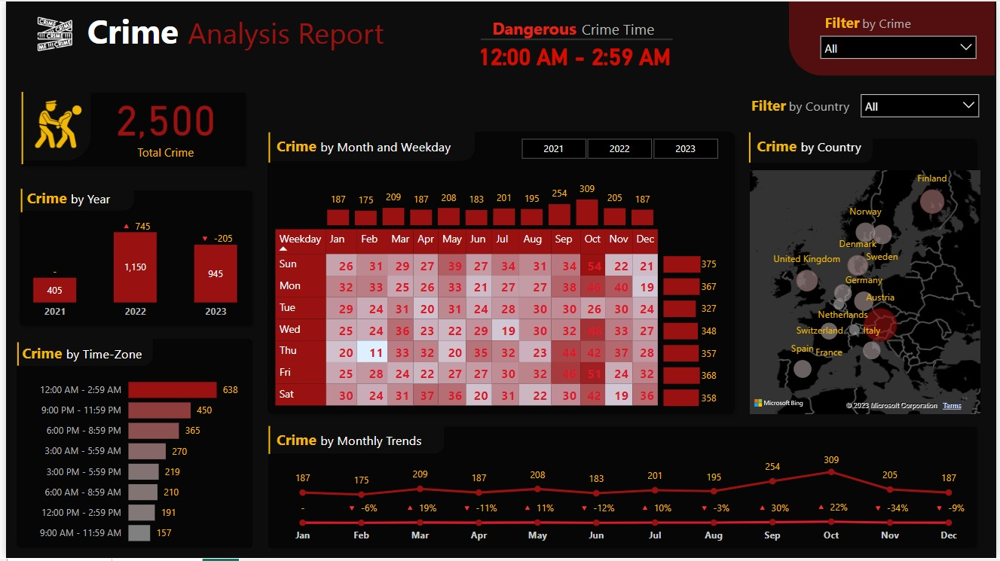

# Crime Data Analysis

## Dashboard Tasks

1. Total Resolved and Unresolved Crimes:
  - Distinction between resolved and unresolved crimes, offering an overview of the overall resolution rate.
2. Monthly Crime Trend with Percentage Variance:
  - Analysis of the monthly crime trend, accompanied by the percentage variance to highlight fluctuations.
3. Identification of the Most Dangerous Time of the Day:
  - Exploration to pinpoint the specific time periods during the day associated with a higher frequency of crimes.

## KPI's Measures -

1. Total Crimes
2. Crime Distribution by Year and Yearly Changes
3. Crimes by Time Range
4. Hitmap for Crime Distribution by Weekdays and Months
5. Crimes by Country
6. Resolved and Unresolved Crimes
7. Monthly Crime Trend with Percentage Variance
8. Identification of Most Dangerous Time of the Day

## Analysis Insights - 

- 'Violence and Sexual Offences' has noticeably more crime rate.
- There is a correlation between Crime numbers and People Involved for Crime 'Violence and Sexual Offences'.
- Crime Numbers and People Involved are correlated by Crime Time with outliers at 12:00 AM, 12:40 AM, 11:05 PM , etc.
- 2022 has a relatively steady percent(49.51%) of total People(1831) Involved.
- 'Austria' has noticeably more People Involved(2644) .
- The resolution rate for crime reached 70.04% as a result of authority efforts.
- A significant portion, Accounting for 29.96% of crimes incidents lacks resolutions.

  

